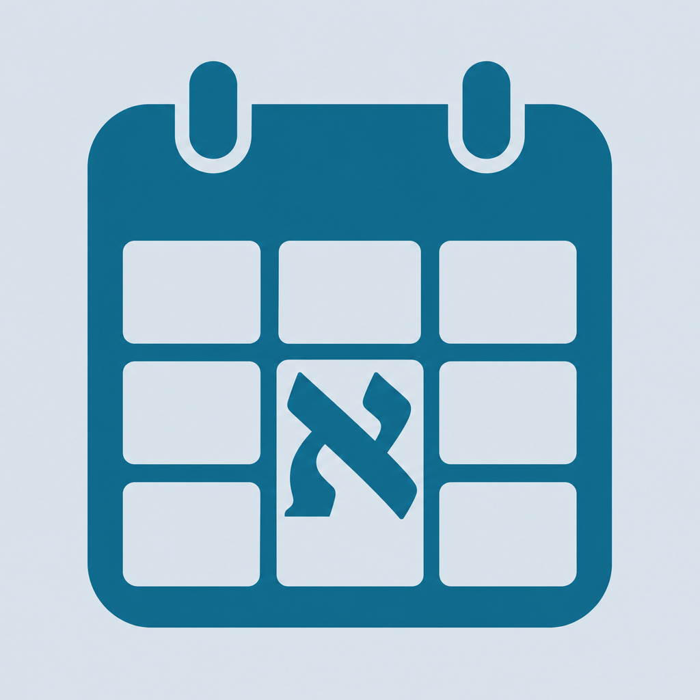
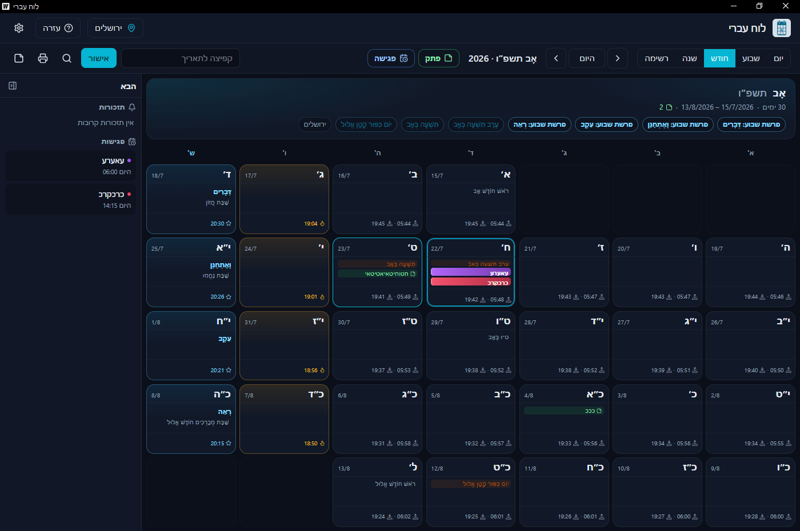
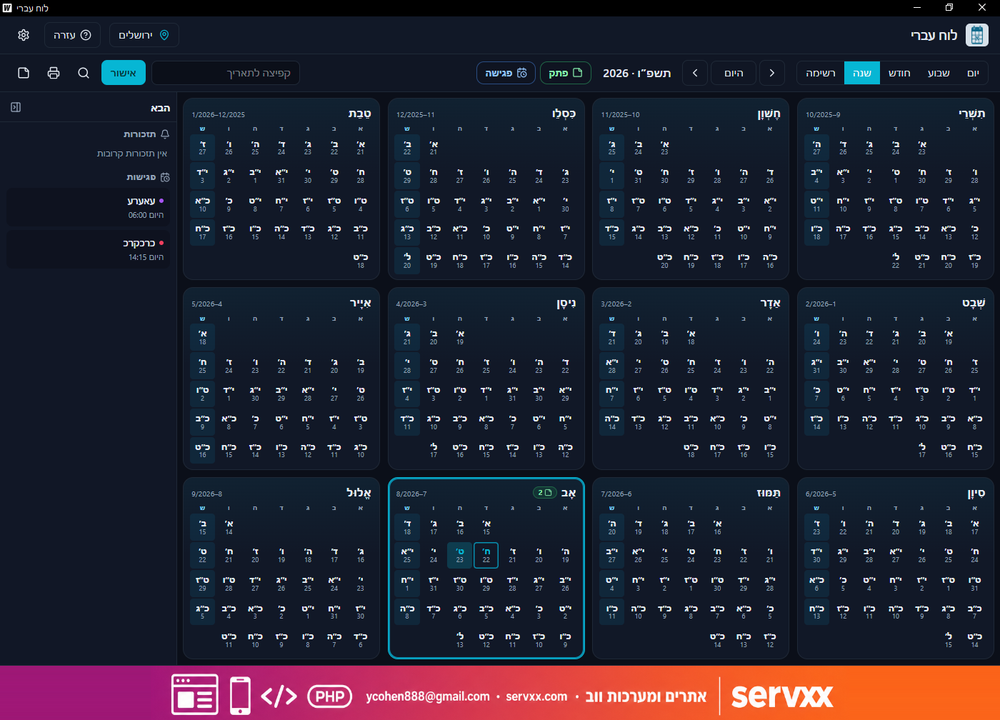

# לוח עברי — Hebrew Calendar ל־Windows

<p align="center">
  
</p>

<p align="center">
  <strong>לוח שנה עברי לדסקטופ</strong> · חינמי · עברית ואנגלית<br/>
  מאת יוסי כהן / <a href="https://servxx.com">servxx.com</a> · 051-5001481
</p>

<p align="center">
  <a href="https://github.com/ycohen888/hebrew-calendar/releases/latest"></a>
  <a href="https://github.com/ycohen888/hebrew-calendar/releases"></a>
</p>

## צילומי מסך

<p align="center">
  
</p>

_תצוגת חודש — חגים, פרשה, זמנים, פתקים ופגישות_

<p align="center">
  
</p>

_תצוגת שנה — סקירה של כל החודשים + פאנל «הבא»_

---

## הורדה

1. עברו ל־[**Releases**](https://github.com/ycohen888/hebrew-calendar/releases/latest)
2. הורידו את **`LuachIvri-amd64-installer.exe`**
3. הריצו את המתקין (מומלץ כמנהל אם Windows מבקש)
4. פתחו **לוח עברי** מתפריט התחל או משולחן העבודה

> **דרישות:** Windows 10/11 (64־bit). אם חסר [WebView2](https://developer.microsoft.com/microsoft-edge/webview2/), המתקין יציע להתקין אותו.

קיצור דרך: [⬇ הורדת הגרסה האחרונה](https://github.com/ycohen888/hebrew-calendar/releases/latest)

---

## מה התוכנה עושה?

| יכולת | פירוט |
|--------|--------|
| **תצוגות** | יום / שבוע / חודש / שנה / רשימת פתקים ופגישות |
| **לוח עברי + לועזי** | תאריך עברי כעיקרי, לועזי משני בכל תא |
| **חגים וזמנים** | חגים, צומות, עומר, פרשת שבוע, הנץ/שקיעה, כניסת/יציאת שבת |
| **עיר** | בחירת עיר בישראל ובעולם לחישוב זמנים |
| **פתקים ותזכורות** | הערות לפי יום + התראות Toast וצליל |
| **פגישות** | פגישות מתוזמנות בציר הזמן (כולל גרירה ליצירה) |
| **חיפוש** | חיפוש בפתקים, פגישות וחגים |
| **הבא** | פאנל צד עם תזכורות ופגישות קרובות |
| **הדפסה** | הדפסה / PDF לתצוגת שבוע או חודש |
| **ערכת נושא** | בהיר / כהה / מערכת · עברית ו־English |

---

## התחלה מהירה

1. בחרו תצוגה: **יום**, **שבוע**, **חודש** או **שנה**
2. בחרו **עיר** בכותרת — לזמני שבת מדויקים
3. נווטו עם אחורה / **היום** / קדימה, או קפצו לתאריך בשדה החיפוש
4. הוסיפו **פתק** או **פגישה** מהסרגל לפי התאריך הנבחר
5. (אופציונלי) בהגדרות — בחרו תצוגת ברירת מחדל, ערכת נושא ושפה

### טיפים

- לחיצה בוחרת יום; **לחיצה כפולה** נכנסת לתצוגת יום
- בתצוגת יום — **גררו** על ציר הזמן ליצירת פגישה
- `Ctrl+K` — חיפוש גלובלי · `Ctrl+P` — הדפסה (בשבוע/חודש)
- פאנל **«הבא»** בצד מציג תזכורות ופגישות קרובות

---

## נתונים מקומיים

הגדרות, פתקים, תזכורות ופגישות נשמרים תחת:

```text
%AppData%\LuachIvri\
```

הסרה: דרך **הוספה/הסרה של תוכניות** ב־Windows (המתקין רושם Uninstaller).

---

## רישיון ושימוש

התוכנה **חינמית** לשימוש, ומסופקת **«כפי שהיא» (AS IS)** ללא אחריות.  
פרטים מלאים ב־[LICENSE](LICENSE).

**בקשה:** נא לא להשתמש בתוכנה בשבת ובימים טובים. תודה.

---

## תמיכה ויצירת קשר

- אתר: [servxx.com](https://servxx.com)
- מייל: [ycohen888@gmail.com](mailto:ycohen888@gmail.com)
- טלפון: **051-5001481**

servxx מפתחת תוכנות דסקטופ, אתרים ומערכות בהזמנה — מהרעיון עד מוצר יציב.

---

## English (short)

**Hebrew Calendar (לוח עברי)** is a free Windows desktop Hebrew calendar (Hebrew + English).

1. Download the installer from [Releases](https://github.com/ycohen888/hebrew-calendar/releases/latest)
2. Install and open **לוח עברי**
3. Switch Day / Week / Month / Year → pick a city → add notes & meetings

Features: holidays & zmanim, Shabbat times by city, notes/reminders, meetings timeline, global search, upcoming panel, print/PDF, dark/light theme.

Provided **AS IS**, free of charge. See [LICENSE](LICENSE).  
Contact: [servxx.com](https://servxx.com) · ycohen888@gmail.com · 051-5001481

---

© יוסי כהן / [servxx.com](https://servxx.com) · לוח עברי v1.0.0
